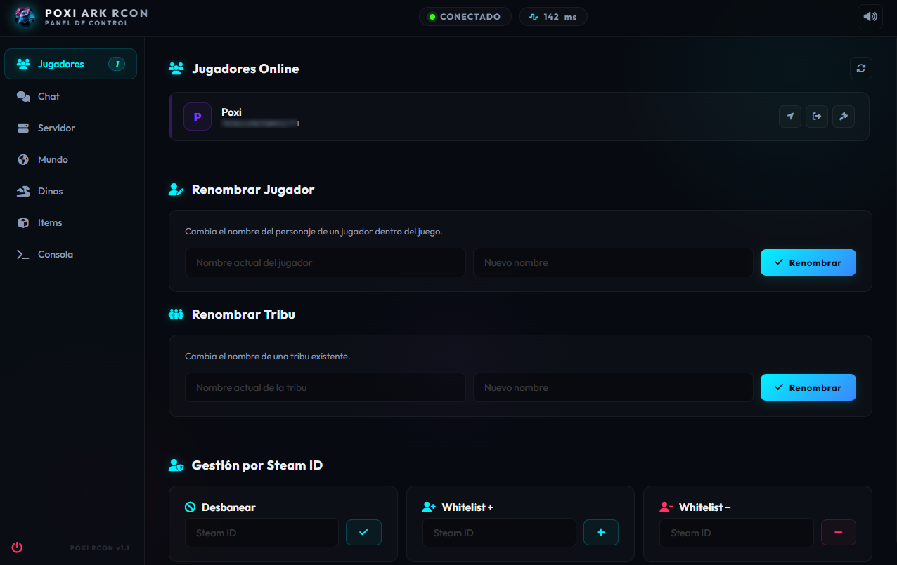

# 🦖 Poxi ARK RCON - Premium Client 🚀

¡Bienvenido al cliente **RCON para ARK: Survival Evolved** más avanzado, intuitivo y estéticamente premium que existe! Diseñado especialmente con una estética **"Hacker / Cyberpunk"** oscura y futurista, sonidos retro/micro-animaciones envolventes, y una interfaz web/desktop sumamente amigable para usar desde cualquier dispositivo (PC, móvil o tablet) sin tener que memorizar un solo comando del juego.

<p align="center">
  
</p>

---

## 🌟 Características Principales

*   🧠 **Sistema Inteligente de Items:**
    *   Buscador interactivo en tiempo real en **Español e Inglés** (ej: buscas "metal", "madera", "pólvora" y lo mapea automáticamente al código GFI correcto del juego).
    *   **Mapeo de Blueprint Paths:** Si le das un item a un jugador específico, la app traduce inteligentemente el nombre del recurso a su Blueprint exacto de ARK para que se entregue a la perfección.
    *   Filtro y selección instantánea por **Categorías Rápidas** con más de 140 ítems mapeados (Armas, Recursos, Estructuras, Comida, Kibbles, Monturas y más).
*   👥 **Control Total de Sobrevivientes:**
    *   Visualiza en tiempo real los jugadores conectados.
    *   Acciones directas a un solo click: **Teleportar a ti**, **Kick (Expulsar)**, o **Ban (Banear permanentemente)** con confirmaciones de seguridad animadas.
    *   Envía mensajes privados en tiempo real a jugadores específicos.
    *   Entrega experiencia (XP) a un jugador específico desde un cómodo desplegable.
*   🎮 **Gestión del Servidor y Entorno:**
    *   **Control del clima:** Lluvia, Niebla, Ola de calor, Tormenta eléctrica, Arena, etc.
    *   **Control del tiempo:** Amanecer, Mediodía, Atardecer, Medianoche con un click o introduce tu hora exacta.
    *   **Spawneo de Dinos Domados:** Selecciona de una base de datos con los 30 dinosaurios más populares a cualquier nivel o introduce su ID interna.
    *   **Acciones de Servidor:** Guardado rápido (`SaveWorld`), Guardar con mensaje Broadcast previo de aviso en pantalla para los jugadores, apagar servidor de forma segura (`DoExit`), y ajustar la velocidad del juego (`Slomo`).
*   📟 **Consola RCON Interactiva:**
    *   Una consola estilo terminal de comandos hacker donde puedes ejecutar cualquier comando manual que desees, con respuesta instantánea del servidor y log en tiempo real.
*   🔊 **Experiencia Premium:**
    *   Efectos de sonido interactivos sintetizados (click, confirmaciones, advertencias y errores) que se pueden silenciar en cualquier momento con un botón de volumen.
    *   Micro-animaciones fluidas de interfaz y diseño totalmente responsivo (perfecto para usar desde tu smartphone mientras juegas en la PC).

---

## 🛠️ Instalación y Uso

### Opción 1: Ejecutable Desktop (.EXE) 🖥️
Si prefieres usarlo como una aplicación nativa en Windows:
1. Ve a la sección de **Releases** en GitHub.
2. Descarga `PoxiARKRcon.exe`.
3. ¡Haz doble click y listo! Se iniciará con su propia ventana nativa y el icónico logo de Poxi.

### Opción 2: Modo Web / Servidor Local (Node.js) 🌐
Si deseas correrlo localmente o hostearlo en un servidor para acceder desde tu móvil:
1. Clona este repositorio:
   ```bash
   git clone https://github.com/PoxiiTV/ARKRcon-UI.git
   cd ARKRcon-UI
   ```
2. Instala las dependencias:
   ```bash
   npm install
   ```
3. Ejecuta el servidor en tu PC. Si quieres modificar el código y ver los cambios en tiempo real en el navegador (modo desarrollo con autorecarga activa en localhost):
   ```bash
   npm run dev
   ```
   Si solo quieres iniciar el servidor de forma normal:
   ```bash
   npm start
   ```
4. Abre **`http://localhost:3000`** en tu navegador y ¡a disfrutar en tiempo real! ⚡

## ⚙️ Configuración y Multi-Servidor (v1.1) 🛠️

En la versión **v1.1**, ¡ya no necesitas editar ningún archivo de código!

1. **Pantalla de Inicio Interactiva:** Al abrir la aplicación web o el ejecutable por primera vez, verás una interfaz cyberpunk elegante donde introducir la **IP del Servidor**, el **Puerto RCON** y la **Contraseña RCON**.
2. **Conexión y Validación en tiempo real:** El sistema probará la conexión RCON de forma segura. Si es correcta, se iniciará el panel.
3. **Persistencia Local (`config.json`):** Tus credenciales se guardarán automáticamente de forma segura en un archivo local llamado `config.json` en la carpeta del programa. Así, la próxima vez que inicies la app, cargará tu servidor instantáneamente.
4. **Desconexión y Cambio de Servidor:** Puedes hacer click en el botón de **Desconectar / Apagar** en la esquina inferior izquierda de la barra lateral en cualquier momento para borrar la configuración actual y conectar otro servidor.

---

## 🚀 Scripts Disponibles

*   `npm start`: Inicia el backend de Node.js.
*   `npm run dev`: Inicia el backend con monitorización en tiempo real de cambios.
*   `npm run electron`: Lanza el cliente nativo de Electron para pruebas locales.
*   `npm run build-exe`: Empaqueta todo el proyecto en un archivo `.exe` con el icono oficial de Poxi en la carpeta `/dist`.

---

## 🛡️ Licencia

Distribuido bajo la licencia MIT. Diseñado con ❤️ por **PoxiiTV & Antigravity**.
